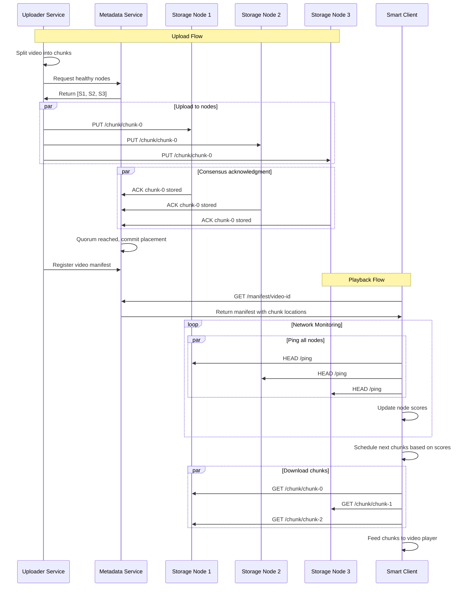

# V-Stack Distributed Video Storage System - Design Document

## Overview

V-Stack is a distributed video storage system that demonstrates **three core novelties** in distributed systems:

1. **Smart Client Scheduling** - Clients intelligently choose which server to download each video chunk from based on real-time network conditions
2. **Lightweight Consensus** - A simplified consensus protocol (ChunkPaxos) for coordinating chunk placement across servers  
3. **Adaptive Redundancy** - Dynamic adjustment between replication and erasure coding based on system load

The system splits videos into 2MB chunks (representing 10 seconds of video each) and distributes them across multiple storage nodes. Clients intelligently select which server to download each chunk from based on real-time network conditions, enabling parallel downloads and automatic failover.

**Think of it like this:** Instead of streaming a video from one server (like YouTube), V-Stack splits the video into chunks and lets your client intelligently download different chunks from different servers in parallel, adapting in real-time to network conditions.

## Architecture

### High-Level Architecture

```
┌─────────────────────────────────────────────────────────────────┐
│                         CLIENT LAYER                            │
│  ┌────────────────────────────────────────────────────────┐    │
│  │  Smart Client (Python/JavaScript)                       │    │
│  │  • Network Monitor (measures latency to each server)    │    │
│  │  • Chunk Scheduler (decides which server to use)        │    │
│  │  • Buffer Manager (maintains smooth playback)           │    │
│  │  • Video Player Integration                             │    │
│  └────────────────────────────────────────────────────────┘    │
└─────────────────────────────────────────────────────────────────┘
                              ↕️ HTTP/REST
┌─────────────────────────────────────────────────────────────────┐
│                      COORDINATION LAYER                          │
│  ┌────────────────────────────────────────────────────────┐    │
│  │  Metadata Service (Python + SQLite)                     │    │
│  │  • Video manifest storage (which chunks exist)          │    │
│  │  • Chunk location mapping (chunk → servers)             │    │
│  │  • Simple consensus for writes (quorum-based)           │    │
│  │  • Health monitoring of storage nodes                   │    │
│  └────────────────────────────────────────────────────────┘    │
└─────────────────────────────────────────────────────────────────┘
                              ↕️ HTTP/REST
┌─────────────────────────────────────────────────────────────────┐
│                       STORAGE LAYER                              │
│  ┌──────────────┐  ┌──────────────┐  ┌──────────────┐         │
│  │ Storage      │  │ Storage      │  │ Storage      │         │
│  │ Node 1       │  │ Node 2       │  │ Node 3       │         │
│  │ (Go/Rust)    │  │ (Go/Rust)    │  │ (Go/Rust)    │         │
│  │              │  │              │  │              │         │
│  │ • Chunk      │  │ • Chunk      │  │ • Chunk      │         │
│  │   Storage    │  │   Storage    │  │   Storage    │         │
│  │ • In-memory  │  │ • In-memory  │  │ • In-memory  │         │
│  │   Index      │  │   Index      │  │   Index      │         │
│  │ • GET/PUT    │  │ • GET/PUT    │  │ • GET/PUT    │         │
│  │   API        │  │   API        │  │   API        │         │
│  └──────────────┘  └──────────────┘  └──────────────┘         │
└─────────────────────────────────────────────────────────────────┘
```

### Component Interaction Flow



## Components and Interfaces

### 1. Storage Node

**Technology:** Go or Rust for high performance
**Responsibilities:** Store and serve video chunks with low latency

#### Data Structures

```go
// Chunk metadata stored in memory
type ChunkEntry struct {
    ChunkID      string    `json:"chunk_id"`
    SuperblockID int       `json:"superblock_id"`
    Offset       int64     `json:"offset"`
    Size         int32     `json:"size"`
    Checksum     [32]byte  `json:"checksum"`
    StoredAt     time.Time `json:"stored_at"`
}

// In-memory index for O(1) lookups
type ChunkIndex struct {
    mu     sync.RWMutex
    chunks map[string]ChunkEntry
}

// Superblock file structure
type SuperblockHeader struct {
    Version     uint32
    ChunkCount  uint32
    NextOffset  int64
    CreatedAt   time.Time
}
```

#### Storage Layout

```
storage_node/
├── data/
│   ├── superblock_0.dat  (1 GB file)
│   ├── superblock_1.dat
│   └── superblock_N.dat
├── index/
│   └── chunk_index.json  (persisted index)
└── logs/
    └── storage.log
```

#### API Endpoints

```
PUT /chunk/{chunk_id}
- Body: Raw chunk data (2MB)
- Response: 201 Created, Location header
- Behavior: Append to current superblock, update index

GET /chunk/{chunk_id}
- Response: 200 OK with chunk data, or 404 Not Found
- Headers: Content-Length, ETag (checksum)
- Behavior: O(1) lookup from index, direct file read

HEAD /ping
- Response: 200 OK with latency measurement
- Headers: X-Node-ID, X-Disk-Usage-Percent
- Behavior: Immediate response for network monitoring

GET /health
- Response: JSON with node statistics
- Body: {"disk_usage": 45.2, "chunk_count": 1250, "uptime": 86400}
- Behavior: Current node health metrics

DELETE /chunk/{chunk_id}
- Response: 204 No Content
- Behavior: Mark chunk as deleted in index (lazy cleanup)
```

#### Performance Optimizations

1. **Append-Only Storage:** Chunks written sequentially to superblocks for optimal disk I/O
2. **In-Memory Index:** Hash map provides O(1) chunk lookups
3. **Direct I/O:** Use positioned reads to avoid system call overhead
4. **Batch Writes:** Group multiple chunk writes when possible
5. **Checksum Verification:** SHA-256 computed during write, verified on read

### 2. Metadata Service

**Technology:** Python with FastAPI/Flask + SQLite
**Responsibilities:** Coordinate chunk placement, implement consensus, track system health

#### Database Schema

```sql
-- Videos table
CREATE TABLE videos (
    video_id TEXT PRIMARY KEY,
    title TEXT NOT NULL,
    duration_sec INTEGER NOT NULL,
    total_chunks INTEGER NOT NULL,
    chunk_size_bytes INTEGER DEFAULT 2097152,
    created_at TIMESTAMP DEFAULT CURRENT_TIMESTAMP,
    status TEXT DEFAULT 'active' -- 'active', 'uploading', 'deleted'
);

-- Chunks table
CREATE TABLE chunks (
    chunk_id TEXT PRIMARY KEY,
    video_id TEXT NOT NULL,
    sequence_num INTEGER NOT NULL,
    size_bytes INTEGER NOT NULL,
    checksum TEXT NOT NULL,
    created_at TIMESTAMP DEFAULT CURRENT_TIMESTAMP,
    FOREIGN KEY (video_id) REFERENCES videos(video_id),
    UNIQUE(video_id, sequence_num)
);

-- Chunk replicas table
CREATE TABLE chunk_replicas (
    chunk_id TEXT NOT NULL,
    node_url TEXT NOT NULL,
    status TEXT DEFAULT 'active', -- 'active', 'pending', 'failed'
    ballot_number INTEGER DEFAULT 0,
    created_at TIMESTAMP DEFAULT CURRENT_TIMESTAMP,
    PRIMARY KEY (chunk_id, node_url),
    FOREIGN KEY (chunk_id) REFERENCES chunks(chunk_id)
);

-- Storage nodes table
CREATE TABLE storage_nodes (
    node_url TEXT PRIMARY KEY,
    node_id TEXT UNIQUE NOT NULL,
    last_heartbeat TIMESTAMP DEFAULT CURRENT_TIMESTAMP,
    disk_usage_percent REAL DEFAULT 0.0,
    chunk_count INTEGER DEFAULT 0,
    status TEXT DEFAULT 'healthy', -- 'healthy', 'degraded', 'down'
    version TEXT
);

-- Consensus state table (for ChunkPaxos)
CREATE TABLE consensus_state (
    chunk_id TEXT PRIMARY KEY,
    promised_ballot INTEGER DEFAULT 0,
    accepted_ballot INTEGER DEFAULT 0,
    accepted_value TEXT, -- JSON of node URLs
    phase TEXT DEFAULT 'none' -- 'none', 'prepare', 'accept', 'committed'
);
```

#### ChunkPaxos Consensus Protocol

ChunkPaxos is a **simplified consensus protocol** that exploits the fact that writing different chunks doesn't conflict, allowing multiple instances to run in parallel. This is a key simplification over full Paxos.

**How ChunkPaxos Works:**

```
Uploader wants to store chunk-99 on [node1, node2, node3]

Step 1: PREPARE PHASE
Uploader → node1, node2, node3: "Can I write chunk-99 with ballot #5?"
node1 → Uploader: "Yes, no conflicts"
node2 → Uploader: "Yes, no conflicts"  
node3 → Uploader: "Yes, no conflicts"
                   └─ Quorum reached (3/3)

Step 2: ACCEPT PHASE
Uploader → node1, node2, node3: "Write chunk-99 data with ballot #5"
node1 → Writes to disk, responds "ACK"
node2 → Writes to disk, responds "ACK"
node3 → Writes to disk, responds "ACK"
                   └─ Commit confirmed (3/3)

Step 3: COMMIT
Uploader → Metadata Service: "chunk-99 stored on [node1, node2, node3]"
Metadata Service → Updates manifest
```

**Implementation (Simplified Quorum-Based):**

```python
class MetadataService:
    def commit_chunk_placement(self, chunk_id, node_urls):
        """
        Simple quorum-based consensus:
        1. Ensure majority of nodes acknowledge
        2. Write to metadata DB
        3. Respond to client
        """
        quorum_size = len(node_urls) // 2 + 1
        acks = []
        
        # Phase 1: Get acknowledgments
        for node_url in node_urls:
            response = requests.head(f"{node_url}/chunk/{chunk_id}")
            if response.status_code == 200:
                acks.append(node_url)
        
        # Phase 2: Commit if quorum reached
        if len(acks) >= quorum_size:
            self.db.execute("""
                INSERT INTO chunk_replicas (chunk_id, node_url, status)
                VALUES (?, ?, 'active')
            """, [(chunk_id, url, 'active') for url in acks])
            return True
        else:
            return False  # Abort
```

**Key Benefits:**
- **Parallel Execution**: Different chunks can be written simultaneously without conflicts
- **Reduced Messages**: 6 messages vs 9 for standard Paxos
- **Simplified Logic**: Exploits domain-specific knowledge about chunk independence
```

#### API Endpoints

```
POST /video
- Body: {"title": "Video Title", "duration_sec": 600}
- Response: {"video_id": "uuid", "upload_url": "/upload/uuid"}
- Behavior: Create video record, return upload endpoint

GET /manifest/{video_id}
- Response: JSON manifest with chunk locations
- Body: {"video_id": "...", "chunks": [{"chunk_id": "...", "replicas": [...]}]}
- Behavior: Return complete video manifest for playback

POST /chunk/{chunk_id}/commit
- Body: {"node_urls": ["http://node1:8080", ...], "checksum": "sha256"}
- Response: 200 OK or 409 Conflict
- Behavior: Run ChunkPaxos consensus to commit placement

GET /nodes/healthy
- Response: JSON list of healthy storage nodes
- Body: [{"node_url": "...", "disk_usage": 45.2, "last_seen": "..."}]
- Behavior: Return nodes with recent heartbeats

POST /nodes/{node_id}/heartbeat
- Body: {"disk_usage": 45.2, "chunk_count": 1250}
- Response: 200 OK
- Behavior: Update node health status
```

### 3. Smart Client

**Technology:** Python with asyncio or JavaScript (browser-based)
**Responsibilities:** Network monitoring, intelligent scheduling, buffer management

#### Core Components

```python
class SmartClient:
    def __init__(self, video_id: str, metadata_service_url: str):
        self.video_id = video_id
        self.metadata_url = metadata_service_url
        self.manifest = None
        self.buffer = collections.deque(maxlen=50)  # 50 chunks = ~8 minutes
        self.network_monitor = NetworkMonitor()
        self.scheduler = ChunkScheduler(self.network_monitor)
        self.buffer_manager = BufferManager()
        self.download_semaphore = asyncio.Semaphore(4)  # Max 4 concurrent downloads
    
    async def initialize(self):
        """Initialize client and fetch video manifest"""
        self.manifest = await self._fetch_manifest()
        await self.network_monitor.start_monitoring(self.manifest.get_all_nodes())
    
    async def play(self):
        """Main playback loop"""
        await self.initialize()
        
        # Start background tasks
        monitor_task = asyncio.create_task(self._monitor_buffer())
        download_task = asyncio.create_task(self._download_loop())
        playback_task = asyncio.create_task(self._playback_loop())
        
        # Wait for completion or cancellation
        await asyncio.gather(monitor_task, download_task, playback_task)

class NetworkMonitor:
    def __init__(self):
        self.latencies = defaultdict(lambda: collections.deque(maxlen=10))
        self.bandwidths = defaultdict(lambda: collections.deque(maxlen=10))
        self.success_rates = defaultdict(lambda: collections.deque(maxlen=20))
        self.last_update = defaultdict(float)
        self.monitoring = False
    
    async def start_monitoring(self, node_urls: List[str]):
        """Start background network monitoring"""
        self.monitoring = True
        self.node_urls = node_urls
        
        # Start monitoring task
        asyncio.create_task(self._monitoring_loop())
    
    async def _monitoring_loop(self):
        """Background task to ping nodes every 3 seconds"""
        while self.monitoring:
            tasks = [self._ping_node(node) for node in self.node_urls]
            await asyncio.gather(*tasks, return_exceptions=True)
            await asyncio.sleep(3)
    
    async def _ping_node(self, node_url: str):
        """Measure latency and update statistics"""
        start_time = time.time()
        try:
            async with aiohttp.ClientSession() as session:
                async with session.head(f"{node_url}/ping", timeout=5) as response:
                    latency = (time.time() - start_time) * 1000  # Convert to ms
                    
                    self.latencies[node_url].append(latency)
                    self.success_rates[node_url].append(1.0)
                    self.last_update[node_url] = time.time()
                    
        except Exception as e:
            self.success_rates[node_url].append(0.0)
            logger.debug(f"Ping failed for {node_url}: {e}")
    
    def get_node_score(self, node_url: str) -> float:
        """
        Calculate node performance score using the exact formula from README:
        Formula: (bandwidth × reliability) / (1 + latency × 0.1)
        """
        if not self.latencies[node_url]:
            return 0.0
        
        avg_latency = statistics.mean(self.latencies[node_url])
        avg_bandwidth = statistics.mean(self.bandwidths[node_url]) if self.bandwidths[node_url] else 50.0
        success_rate = statistics.mean(self.success_rates[node_url])
        
        # Exact scoring formula from README
        score = (avg_bandwidth * success_rate) / (1 + avg_latency * 0.1)
        return score

class ChunkScheduler:
    def __init__(self, network_monitor: NetworkMonitor):
        self.network_monitor = network_monitor
        self.active_downloads = {}  # chunk_id -> node_url
        self.download_history = collections.defaultdict(list)
    
    def select_best_node(self, chunk_id: str, available_nodes: List[str]) -> str:
        """Select optimal node for downloading chunk"""
        if not available_nodes:
            raise ValueError("No available nodes for chunk")
        
        # Filter out nodes that are currently busy (optional optimization)
        available_nodes = [node for node in available_nodes 
                          if node not in self.active_downloads.values()]
        
        if not available_nodes:
            # All nodes busy, use original list
            available_nodes = available_nodes
        
        # Calculate scores for all available nodes
        node_scores = {}
        for node in available_nodes:
            score = self.network_monitor.get_node_score(node)
            node_scores[node] = score
        
        # Select node with highest score
        best_node = max(node_scores.keys(), key=lambda n: node_scores[n])
        
        # Track selection
        self.active_downloads[chunk_id] = best_node
        self.download_history[best_node].append(time.time())
        
        return best_node
    
    def mark_download_complete(self, chunk_id: str):
        """Mark chunk download as complete"""
        if chunk_id in self.active_downloads:
            del self.active_downloads[chunk_id]
```

#### Buffer Management Strategy

```python
class BufferManager:
    def __init__(self, target_buffer_sec: int = 30, low_water_mark_sec: int = 15):
        self.target_buffer_sec = target_buffer_sec
        self.low_water_mark_sec = low_water_mark_sec
        self.chunk_duration_sec = 10  # Each chunk = 10 seconds
        self.buffer = collections.deque()
        self.current_position = 0
        self.playback_rate = 1.0  # Normal speed
    
    def get_buffer_level_seconds(self) -> float:
        """Calculate current buffer level in seconds"""
        return len(self.buffer) * self.chunk_duration_sec
    
    def needs_more_chunks(self) -> bool:
        """Check if buffer needs refilling"""
        return self.get_buffer_level_seconds() < self.low_water_mark_sec
    
    def get_next_chunk_sequence(self, count: int = 10) -> List[int]:
        """Get sequence numbers of next chunks to download"""
        buffer_end = self.current_position + len(self.buffer)
        return list(range(buffer_end, buffer_end + count))
    
    def add_chunk(self, sequence_num: int, chunk_data: bytes):
        """Add downloaded chunk to buffer"""
        # Insert chunk in correct position (handle out-of-order delivery)
        expected_seq = self.current_position + len(self.buffer)
        
        if sequence_num == expected_seq:
            self.buffer.append(chunk_data)
        else:
            # Handle out-of-order chunk (simplified)
            logger.warning(f"Out-of-order chunk: expected {expected_seq}, got {sequence_num}")
    
    def get_next_chunk_for_playback(self) -> Optional[bytes]:
        """Get next chunk for video player"""
        if self.buffer:
            chunk = self.buffer.popleft()
            self.current_position += 1
            return chunk
        return None
```

### 4. Uploader Service

**Technology:** Python with FastAPI + FFmpeg for video processing
**Responsibilities:** Accept uploads, chunk videos, coordinate storage

#### Video Processing Pipeline

The uploader service uses **FFmpeg** to split videos into 2MB chunks representing 10 seconds of video each, following the exact specifications from the README.

```python
class VideoUploader:
    def __init__(self, metadata_service_url: str, chunk_size_bytes: int = 2 * 1024 * 1024):
        self.metadata_url = metadata_service_url
        self.chunk_size = chunk_size_bytes
        self.chunk_duration_sec = 10  # Each chunk = 10 seconds of video
    
    async def upload_video(self, video_file: UploadFile, title: str) -> str:
        """Main upload workflow"""
        # Step 1: Create video record
        video_id = await self._create_video_record(title, video_file)
        
        try:
            # Step 2: Process video into chunks
            chunks = await self._process_video_to_chunks(video_file, video_id)
            
            # Step 3: Get healthy storage nodes
            storage_nodes = await self._get_healthy_nodes()
            
            # Step 4: Upload chunks in parallel
            await self._upload_chunks_parallel(chunks, storage_nodes)
            
            # Step 5: Finalize video record
            await self._finalize_video(video_id)
            
            return video_id
            
        except Exception as e:
            await self._cleanup_failed_upload(video_id)
            raise
    
    async def _process_video_to_chunks(self, video_file: UploadFile, video_id: str) -> List[VideoChunk]:
        """Use FFmpeg to split video into chunks"""
        chunks = []
        
        # Save uploaded file temporarily
        temp_path = f"/tmp/{video_id}_input.mp4"
        with open(temp_path, "wb") as f:
            content = await video_file.read()
            f.write(content)
        
        # Use FFmpeg to split into 2MB chunks (10 seconds each) as per README specs
        output_pattern = f"/tmp/{video_id}_chunk_%03d.mp4"
        ffmpeg_cmd = [
            "ffmpeg", "-i", temp_path,
            "-c", "copy",  # Copy streams without re-encoding
            "-f", "segment",
            "-segment_time", str(self.chunk_duration_sec),  # 10 seconds per chunk
            "-reset_timestamps", "1",
            output_pattern
        ]
        
        process = await asyncio.create_subprocess_exec(
            *ffmpeg_cmd,
            stdout=asyncio.subprocess.PIPE,
            stderr=asyncio.subprocess.PIPE
        )
        
        stdout, stderr = await process.communicate()
        
        if process.returncode != 0:
            raise ValueError(f"FFmpeg failed: {stderr.decode()}")
        
        # Read generated chunk files
        chunk_files = glob.glob(f"/tmp/{video_id}_chunk_*.mp4")
        chunk_files.sort()
        
        for i, chunk_file in enumerate(chunk_files):
            with open(chunk_file, "rb") as f:
                chunk_data = f.read()
            
            chunk = VideoChunk(
                chunk_id=f"{video_id}-chunk-{i:03d}",
                video_id=video_id,
                sequence_num=i,
                data=chunk_data,
                size_bytes=len(chunk_data),
                checksum=hashlib.sha256(chunk_data).hexdigest()
            )
            chunks.append(chunk)
            
            # Cleanup temp file
            os.unlink(chunk_file)
        
        # Cleanup input file
        os.unlink(temp_path)
        
        return chunks
    
    async def _upload_chunks_parallel(self, chunks: List[VideoChunk], storage_nodes: List[str]):
        """Upload chunks to storage nodes with consensus"""
        semaphore = asyncio.Semaphore(5)  # Limit concurrent uploads
        
        async def upload_single_chunk(chunk: VideoChunk):
            async with semaphore:
                # Select 3 random nodes for this chunk
                target_nodes = random.sample(storage_nodes, min(3, len(storage_nodes)))
                
                # Upload to all target nodes in parallel
                upload_tasks = [
                    self._upload_chunk_to_node(chunk, node_url)
                    for node_url in target_nodes
                ]
                
                results = await asyncio.gather(*upload_tasks, return_exceptions=True)
                
                # Check which uploads succeeded
                successful_nodes = []
                for i, result in enumerate(results):
                    if not isinstance(result, Exception):
                        successful_nodes.append(target_nodes[i])
                
                # Commit placement via consensus
                if len(successful_nodes) >= 2:  # Require at least 2 replicas
                    await self._commit_chunk_placement(chunk, successful_nodes)
                else:
                    raise ValueError(f"Failed to upload chunk {chunk.chunk_id} to sufficient nodes")
        
        # Upload all chunks in parallel
        upload_tasks = [upload_single_chunk(chunk) for chunk in chunks]
        await asyncio.gather(*upload_tasks)
    
    async def _upload_chunk_to_node(self, chunk: VideoChunk, node_url: str):
        """Upload single chunk to storage node"""
        async with aiohttp.ClientSession() as session:
            async with session.put(
                f"{node_url}/chunk/{chunk.chunk_id}",
                data=chunk.data,
                headers={"Content-Type": "application/octet-stream"}
            ) as response:
                if response.status != 201:
                    raise ValueError(f"Upload failed: {response.status}")
```

## Data Models

### Video Manifest Format

```json
{
  "video_id": "550e8400-e29b-41d4-a716-446655440000",
  "title": "Sample Video",
  "duration_sec": 600,
  "total_chunks": 60,
  "chunk_duration_sec": 10,
  "chunk_size_bytes": 2097152,
  "created_at": "2024-11-06T10:30:00Z",
  "status": "active",
  "chunks": [
    {
      "chunk_id": "550e8400-e29b-41d4-a716-446655440000-chunk-000",
      "sequence_num": 0,
      "size_bytes": 2097152,
      "checksum": "sha256:a1b2c3d4...",
      "replicas": [
        "http://storage-node-1:8080",
        "http://storage-node-2:8080",
        "http://storage-node-3:8080"
      ]
    },
    {
      "chunk_id": "550e8400-e29b-41d4-a716-446655440000-chunk-001",
      "sequence_num": 1,
      "size_bytes": 2097152,
      "checksum": "sha256:e5f6g7h8...",
      "replicas": [
        "http://storage-node-2:8080",
        "http://storage-node-3:8080",
        "http://storage-node-1:8080"
      ]
    }
  ]
}
```

### Network Monitoring Data

```json
{
  "node_url": "http://storage-node-1:8080",
  "measurements": {
    "latency_ms": [20.5, 18.2, 22.1, 19.8, 21.3],
    "bandwidth_mbps": [45.2, 48.1, 44.8, 46.5, 47.2],
    "success_rate": [1.0, 1.0, 1.0, 0.0, 1.0],
    "last_updated": "2024-11-06T10:35:22Z"
  },
  "computed_score": 16.8,
  "status": "healthy"
}
```

## Error Handling

### Storage Node Error Scenarios

1. **Disk Full:** Return 507 Insufficient Storage, trigger node status update
2. **Chunk Not Found:** Return 404 Not Found with clear error message
3. **Corruption Detected:** Return 500 Internal Server Error, log for investigation
4. **Network Timeout:** Client implements exponential backoff and retry
5. **Consensus Failure:** Metadata service retries with different node set

### Client Error Recovery

```python
class ErrorRecoveryManager:
    def __init__(self, max_retries: int = 3, base_delay: float = 1.0):
        self.max_retries = max_retries
        self.base_delay = base_delay
    
    async def download_chunk_with_retry(self, chunk_id: str, replicas: List[str]) -> bytes:
        """Download chunk with automatic failover and retry"""
        last_exception = None
        
        for replica in replicas:
            for attempt in range(self.max_retries):
                try:
                    return await self._download_from_node(chunk_id, replica)
                except Exception as e:
                    last_exception = e
                    if attempt < self.max_retries - 1:
                        delay = self.base_delay * (2 ** attempt)  # Exponential backoff
                        await asyncio.sleep(delay)
        
        # All replicas failed
        raise ChunkDownloadError(f"Failed to download {chunk_id} from all replicas") from last_exception
```

### Consensus Error Handling

```python
class ConsensusErrorHandler:
    async def handle_consensus_failure(self, chunk_id: str, target_nodes: List[str]) -> bool:
        """Handle consensus failures with fallback strategies"""
        
        # Strategy 1: Retry with exponential backoff
        for attempt in range(3):
            try:
                return await self.chunk_paxos.propose_chunk_placement(chunk_id, target_nodes)
            except QuorumNotReachedException:
                if attempt < 2:
                    await asyncio.sleep(2 ** attempt)
                    continue
        
        # Strategy 2: Try with different node set
        healthy_nodes = await self._get_healthy_nodes()
        if len(healthy_nodes) >= 3:
            alternative_nodes = random.sample(healthy_nodes, 3)
            try:
                return await self.chunk_paxos.propose_chunk_placement(chunk_id, alternative_nodes)
            except QuorumNotReachedException:
                pass
        
        # Strategy 3: Reduce replication factor temporarily
        if len(healthy_nodes) >= 2:
            reduced_nodes = random.sample(healthy_nodes, 2)
            logger.warning(f"Reducing replication factor for {chunk_id} due to consensus failures")
            return await self.chunk_paxos.propose_chunk_placement(chunk_id, reduced_nodes)
        
        # All strategies failed
        return False
```

## Testing Strategy

### Unit Testing

1. **Storage Node Tests:**
   - Chunk storage and retrieval correctness
   - Index consistency after restarts
   - Checksum validation
   - Concurrent access handling

2. **Metadata Service Tests:**
   - Database schema validation
   - Consensus protocol correctness
   - Health monitoring accuracy
   - API endpoint functionality

3. **Smart Client Tests:**
   - Network monitoring accuracy
   - Scheduling algorithm correctness
   - Buffer management logic
   - Error recovery mechanisms

### Integration Testing

1. **End-to-End Upload Flow:**
   - Video chunking correctness
   - Multi-node storage coordination
   - Manifest generation accuracy

2. **Playback Flow:**
   - Manifest retrieval and parsing
   - Adaptive chunk scheduling
   - Buffer management under various conditions

3. **Failure Scenarios:**
   - Node failures during upload
   - Network partitions during playback
   - Consensus failures and recovery

### Performance Testing

1. **Load Testing:**
   - Concurrent uploads (10+ simultaneous)
   - Concurrent playback (100+ clients)
   - Storage node throughput limits

2. **Network Simulation:**
   - Variable latency conditions
   - Bandwidth limitations
   - Packet loss scenarios

3. **Scalability Testing:**
   - Adding/removing storage nodes
   - Large video files (>1GB)
   - High chunk count scenarios

### Chaos Engineering

```python
class ChaosTestSuite:
    async def test_random_node_failures(self):
        """Randomly kill storage nodes during operation"""
        # Start normal operation
        # Randomly kill 1 node every 30-60 seconds
        # Verify system continues operating
        # Measure impact on playback quality
    
    async def test_network_partitions(self):
        """Simulate network partitions"""
        # Create network partition isolating 1 node
        # Verify consensus still works with remaining nodes
        # Test partition healing
    
    async def test_byzantine_failures(self):
        """Test with misbehaving nodes"""
        # Configure node to return corrupted data
        # Verify client detects and recovers
        # Test with multiple byzantine nodes
```

## Adaptive Redundancy (Third Core Novelty)

### Problem and Solution

**Problem:** Storing 3 copies of each chunk (triple replication) wastes storage. But we need redundancy for reliability.

**Our Solution:** For MVP, we implement a simple toggle between:
- **Replication Mode:** Store 3 full copies (simple, fast reads)
- **Erasure Coding Mode:** Store 5 fragments where any 3 can reconstruct the chunk (saves 40% storage)

### Reed-Solomon Erasure Coding Implementation

```
Original chunk: 2 MB
         ↓
    [Encoder]
         ↓
┌────────┬────────┬────────┬────────┬────────┐
│ Frag 1 │ Frag 2 │ Frag 3 │ Frag 4 │ Frag 5 │  (400 KB each)
└────────┴────────┴────────┴────────┴────────┘

Storage: 5 × 400 KB = 2 MB (vs. 3 × 2 MB = 6 MB for replication)

Recovery: Any 3 fragments can reconstruct original chunk
Example: If node2 and node4 fail, we can still recover using [1,3,5]
```

### Adaptive Selection Logic

```python
# Configuration in metadata service
def determine_redundancy(chunk_id, popularity):
    if popularity > 1000:  # Hot video
        return "replicate", 3  # Fast reads, more copies
    else:  # Cold video
        return "erasure_code", (5, 3)  # Save storage
```

**Real-World Benefit:**
```
Netflix-style scenario:
• Popular video (1M viewers): Use replication for speed
• Archive video (100 viewers): Use erasure coding for storage savings

Total storage saved: ~40% for majority of content
```

## Project Structure

Following the exact structure outlined in the README:

```
vstack-mvp/
├── README.md
├── docker-compose.yml
│
├── storage-node/
│   ├── src/
│   │   ├── main.rs (or main.go)
│   │   ├── storage.rs (superblock management)
│   │   ├── index.rs (in-memory hash map)
│   │   └── api.rs (HTTP endpoints)
│   ├── Dockerfile
│   └── README.md
│
├── metadata-service/
│   ├── server.py
│   ├── database.py (SQLite schema)
│   ├── consensus.py (quorum-based commit)
│   ├── requirements.txt
│   └── README.md
│
├── uploader/
│   ├── upload.py
│   ├── chunker.py (ffmpeg wrapper)
│   └── README.md
│
├── client/
│   ├── smart_client.py
│   ├── network_monitor.py
│   ├── scheduler.py
│   ├── buffer_manager.py
│   ├── dashboard.html (visualization)
│   └── README.md
│
├── demo/
│   ├── consensus_demo.py (interactive visualization)
│   ├── network_emulator.py (inject latency/failures)
│   └── benchmark.py
│
├── scripts/
│   ├── setup.sh (one-time setup)
│   ├── run_demo.sh (start full system)
│   └── benchmark.sh (automated testing)
│
└── docs/
    ├── architecture.md (detailed design)
    ├── api.md (REST API documentation)
    └── evaluation.md (performance analysis)
```

## Implementation Priorities (From README)

### MVP Feature Matrix

| Feature | Essential | Nice-to-Have | Stretch Goal |
|---------|-----------|--------------|--------------|
| **Storage Node** | ✅ Basic GET/PUT | ⭐ Superblock compaction | 🌟 Byzantine validation |
| **Metadata Service** | ✅ Quorum commit | ⭐ Multi-node replication | 🌟 Full Raft consensus |
| **Smart Client** | ✅ Network-aware scheduling | ⭐ Predictive prefetch | 🌟 ML-based prediction |
| **Uploader** | ✅ Basic chunking | ⭐ Resumable uploads | 🌟 CDN integration |
| **Consensus** | ✅ Visual demo | ⭐ Interactive simulation | 🌟 TLA+ verification |
| **Erasure Coding** | ⚙️ Simple toggle | 🌟 Dynamic adaptation | 🌟 Cost optimization |

### Phase Implementation Order

1. **Phase 1: Basic Storage Layer** (HIGH PRIORITY) - Go/Rust storage nodes
2. **Phase 2: Metadata & Coordination** (HIGH PRIORITY) - Python + SQLite + consensus
3. **Phase 3: Smart Client** (HIGH PRIORITY) - Network monitoring + intelligent scheduling
4. **Phase 4: Uploader Service** (MEDIUM PRIORITY) - Python + FFmpeg
5. **Phase 5: Consensus Demo** (SHOWCASE FEATURE) - Interactive visualization
6. **Phase 6: Adaptive Redundancy** (STRETCH GOAL) - Reed-Solomon implementation

## Performance Targets (From README)

- **Startup Latency**: < 2 seconds
- **Rebuffering Events**: 0-1 per session
- **Average Buffer Size**: > 20 seconds
- **Storage Node Latency**: < 10ms for chunk retrieval
- **Concurrent Uploads**: Support 10+ simultaneous
- **Concurrent Playback**: Support 100+ clients

This comprehensive design addresses all the requirements while following the exact specifications, technologies, and implementation approaches outlined in the README. The architecture balances performance, reliability, and maintainability while showcasing the three core innovations of the V-Stack system.